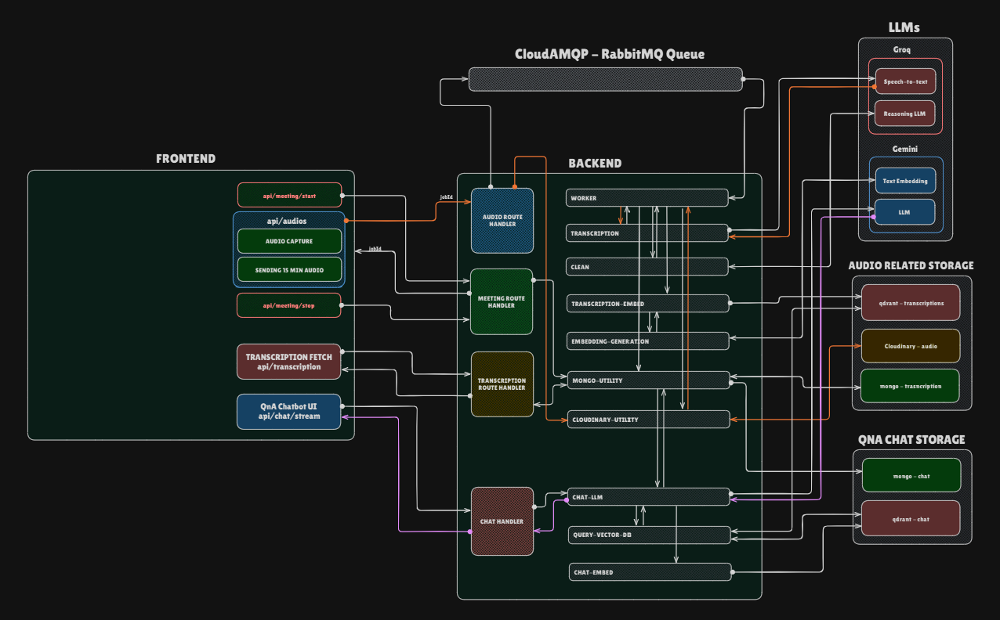

## 🎙️ Concize RAG Pipeline Backend

A backend service for audio transcription and **RAG** (Retrieval-Augmented Generation) pipeline.
This service uses:

* 🐇 **RabbitMQ** – for asynchronous message queuing
* 🎧 **Groq** – for audio transcription (max 25MB per file)
* 🧠 **Qdrant** – for vector storage and semantic search
* 🌐 **Gemini** – for generating embeddings
* ☁️ **Cloudinary** – for audio file storage
* 📦 **MongoDB** – for storing transcriptions and chat history

## 🔄 System Architecture



The system follows these steps:
1. Audio files are uploaded and stored in Cloudinary
2. RabbitMQ queues the audio for processing
3. Worker processes audio using Groq for transcription
4. Transcriptions are stored in MongoDB
5. Gemini generates embeddings for semantic search
6. Embeddings are stored in Qdrant
7. Chat queries use RAG to provide context-aware responses

## ⚙️ Setup

### 1. Install Dependencies

```bash
cd backend
npm install
```

### 2. Environment Variables

Create a `.env` file in the backend directory with:

```env
# Server Configuration
PORT=3000
NODE_ENV=development

# Groq API for transcription and cleaning
GROQ_API_KEY=<your_groq_api_key>

# RabbitMQ for message queue
CLOUDAMQP_URL=<your_cloudamqp_url>

# MongoDB for data storage
MONGODB_URL=<your_mongodb_url>

# Qdrant for vector storage
QDRANT_URL=<your_qdrant_url>
QDRANT_API_KEY=<your_qdrant_api_key>

# Cloudinary for audio storage
CLOUDINARY_CLOUD_NAME=<your_cloud_name>
CLOUDINARY_API_KEY=<your_cloudinary_key>
CLOUDINARY_API_SECRET=<your_cloudinary_secret>

# Google Gemini API for embeddings
GEMINI_API_KEY=<your_gemini_api_key>
```


---

## 📡 API Endpoints

### Worker Management

#### `POST /api/worker/start`
- **Description**: Starts the worker process for audio processing
- **Response**: `{ "message": "Worker started." }`

#### `POST /api/worker/stop`
- **Description**: Gracefully stops the worker
- **Response**: `{ "message": "Worker stopping..." }`

#### `GET /api/worker/status`
- **Description**: Gets worker status
- **Response**: `{ "status": "running" | "stopped" }`

### Audio Processing

#### `POST /api/audios`
- **Description**: Upload audio for transcription
- **Request**: `multipart/form-data`
  - Field: `audio`
  - Formats: mp3, wav, flac, m4a, ogg, webm, mp4
  - Max size: 25MB (Groq API limit)
  - Max duration: 15 minutes
- **Response**: `{ "message": "Audio received and queued" }`

### Chat Endpoints

#### `POST /api/chat`
- **Description**: Send a message for RAG-enhanced response
- **Request Body**:
  ```json
  {
    "message": "Your question",
    "jobId": "transcription_job_id"
  }
  ```
- **Response**: Server-Sent Events (SSE) with AI responses

## 🔁 Usage Workflow

1. **Start the Worker**
   ```bash
   curl -X POST http://localhost:3000/api/worker/start
   ```

2. **Upload Audio**
   ```bash
   curl -X POST http://localhost:3000/api/audios \
        -F "audio=@./your-audio.mp3" \
        -H "Content-Type: multipart/form-data"
   ```

3. **Chat with Transcription**
   ```bash
   curl -X POST http://localhost:3000/api/chat \
        -H "Content-Type: application/json" \
        -d '{"message": "What was discussed?", "jobId": "your_job_id"}'
   ```

## 🚀 Running the Server

Start the development server:

```bash
cd backend
npm run dev
```

The server will start on PORT 3000 (default) or the port specified in your `.env`

